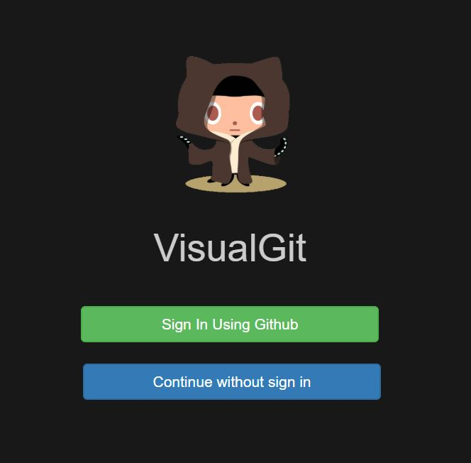
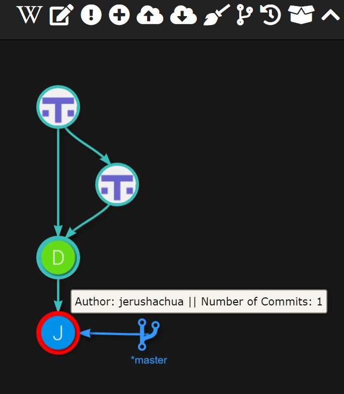

# VisualGit
University of Victoria SENG421

VisualGit is desktop application built with node and AngularJS.

The app is meant to help beginners intuitively learn how git works. The app can open git repositories and visually represent the branches of the git repo.

VisualGit was originally developed at the University of Auckland.



### Installation

This app requires ````npm```` and ````node````.

### Repository Setup

Clone the repository. Navigate to the root directory.

````
npm install
````
then ... for Windows
````
npm start
````

or ... for mac
````
npm run macstart
````


